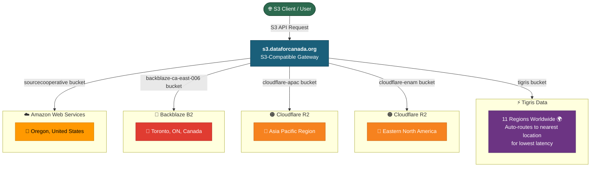
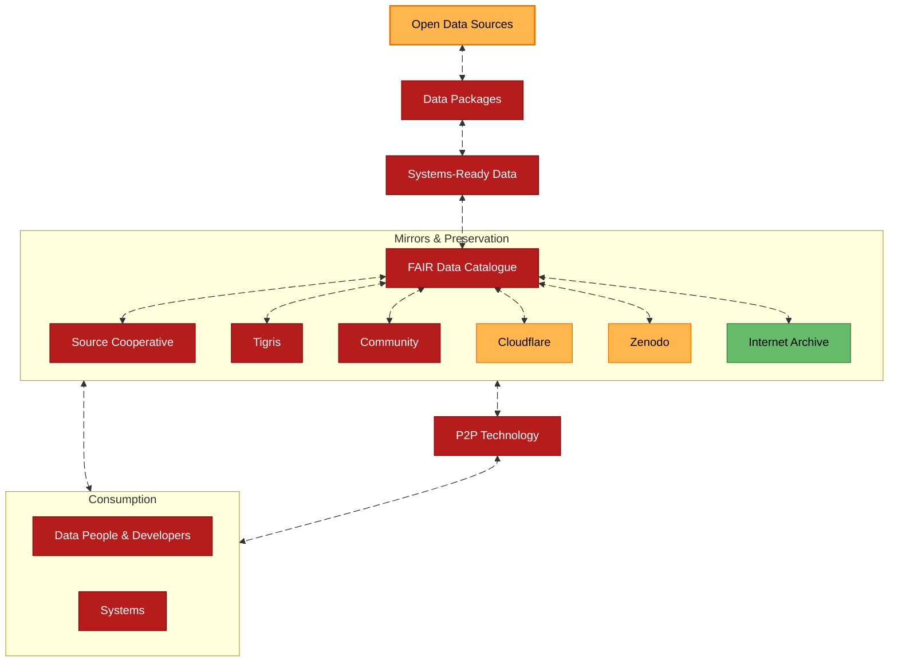
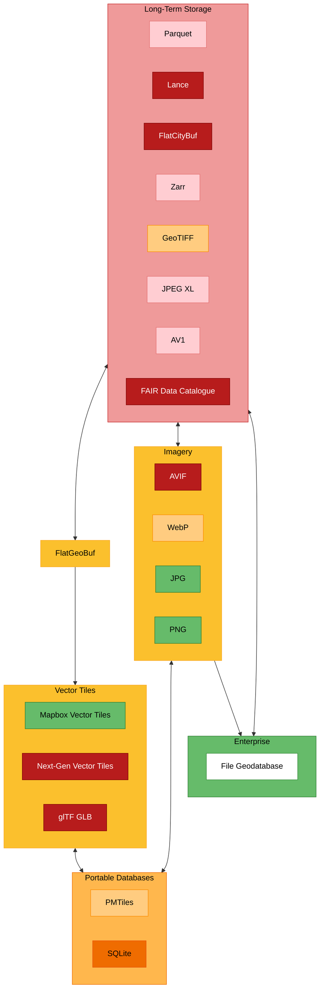
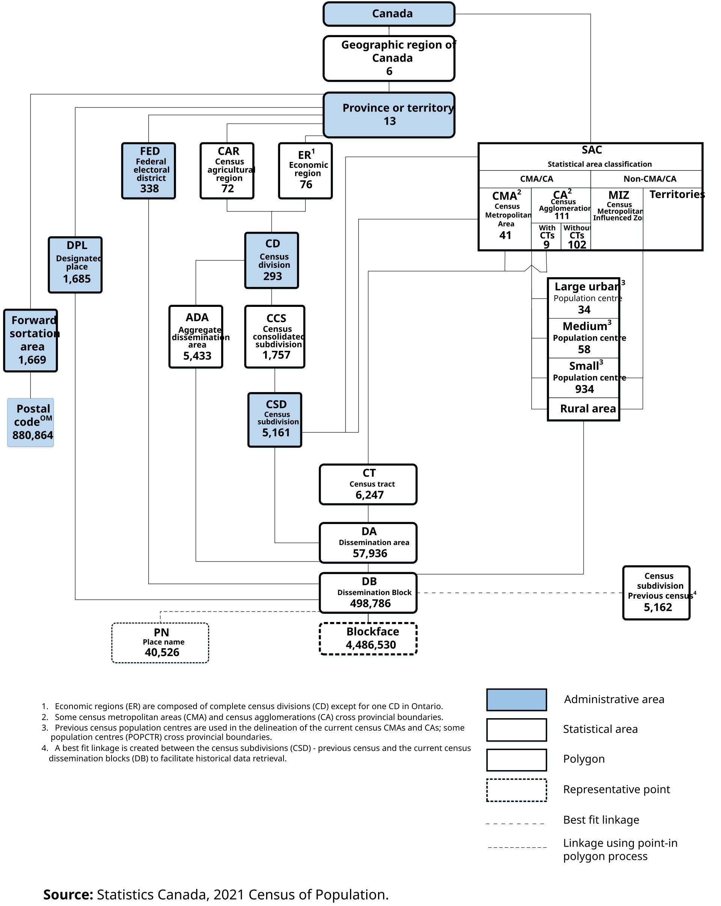
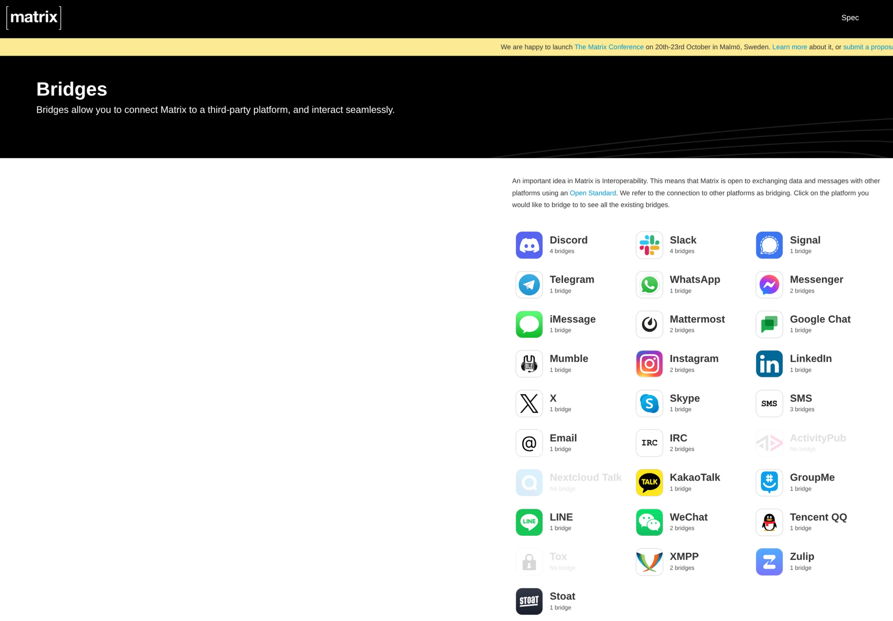

# Data for Canada / the Universe

## Background and Strategy
Presented By: Diego Ripley

Date: April 10, 2026

---
layout: cover
hideInToc: true
---

"Space is big. You just won't believe how vastly, hugely, mind-bogglingly big it is. I mean, you may think it's a long way down the road to the chemist's, but that's just peanuts to space."

Douglas Adams, Hitchicker's Guide to the Galaxy, #1

---
hideInToc: true
level: 4
---

---
---
- This slide can go into size of dataset in specific bucket. For example, sourcecooperative has X TBs worth of data.

---
layout: iframe-unscaled
hideInToc: true
level: 4
url: https://objex.labs.dataforcanada.org/
---

<!--
- And this is the feeling I want to capture.
-->

---
layout: cover
transition: slide-left
hideInToc: true
---

  <a href="https://github.com/datafortheuniverse/d4u-service-main-site/issues/1">Github Issue</a>

 

---
layout: two-cols-header
zoom: 1.2
transition: slide-left
hideInToc: true
---

# Notes
::left::
- Keep questions after presentation

<!--
- Please keep questions after presentation as I may lose my focus if I get interrupted. If you do have a question, put it on the chat, ideally with slide number.
-->

---
hideInToc: true
transition: slide-left
zoom: 0.8
---
# Table of Contents
<Toc text-sm minDepth="1" maxDepth="3" />

---
layout: center
hideInToc: true
---

# Guide By

* [Cloud-Native Geospatial Storage Cheatsheet](https://bdon.github.io/cng-storage-guide/)
* [Guidance on Assessing Readiness to Manage Data According to the Findable, Accessible, Interoperable and Reusable (FAIR) Principles](https://www.canada.ca/en/government/system/digital-government/digital-government-innovations/information-management/guidance-assessing-readiness-manage-data-according-findable-accessible-interoperable-reusable-principles.html)
* [Cloud-Optimized Geospatial Formats Guide](https://guide.cloudnativegeo.org/)
* [Link rot in LIS literature: a 20-year study of web citation decay, recovery and preservation challenges](https://doi.org/10.1108/AJIM-05-2025-0286)
* [Science Needs a Social Network for Sharing Big Data](https://hackmd.io/wKKm4cIDR6a9kYwZ3srVFg?view)
* [Sustainability of Digital Formats: Planning for Library of Congress Collections](https://www.loc.gov/preservation/digital/formats/index.html)
* [GC White Paper: Data Sovereignty and Public Cloud](https://www.canada.ca/en/government/system/digital-government/digital-government-innovations/cloud-services/digital-sovereignty/gc-white-paper-data-sovereignty-public-cloud.html)

<!--
- Skip over this on next presentation, people are focused on the technical side.
-->

---
layout: center
transition: slide-left
hideInToc: true
---

# In Plain Words

<v-clicks>

- Make sure that data lasts as long as humanly possible presenting all perspectives by creating efficient data and processes for long-term archival.
- I want what I am building to be in libraries.
- Create processes, tools, infrastructure, datasets to empower everyday citizens, to make their lifes just a little easier, to filter all of the noise.
- Yes, **ethics** is at the core of everything.

</v-clicks>

<!--
- This is where the MCP project that was mentioned to me by Geoff can be introduced.
-->

---
layout: center
---

- And for any citizen to contribute to its resilience. This is why my project makes use of P2P technologies (ex. [BitTorrent](https://tixati.com/specs/bittorrent), [IPFS](https://ipfs.tech/), [libp2p](https://libp2p.io/))
- Hence the [data dissemination strategy](https://www.dataforcanada.org/docs/d4c-infra-distribution/).

<!--
- Yes, that does mean utilizing everyday citizens in decentralized distribution of data
-->

---
layout: center
---

<!--
- There's a reason that the arrows are two ways. From data packages to open data sources means that we as a community need to provide specific feedback on datasets released by the government. Like I said, we can start by prioritizing datasets on significance to the community. If we need a union to push back on datasets, so be it.
-->

---
layout: center
level: 1
---

# Solutions

---
layout: center
level: 2
---

# Assess

Mapping **data portals** and all **data assets** in Canada. 

<!--
---
layout: iframe-unscaled
url: https://directory.opendatasociety.ca/directory
level: 2
---
-->

<!--
- This is a start. We need to do better.
- Create parquet dataset of the data portals.
- Actually assess how difficult it is to export data from each data portal. For example, 
-->

---
layout: center
level: 2
---

## Rank
- Rank datasets according to impact on Canadians (ex. COVID-19 death cases by [dissemination block](https://www150.statcan.gc.ca/n1/pub/92-195-x/2021001/geo/db-id/db-id-eng.htm)).

---
layout: iframe-unscaled
url: https://dataindex.us/collections/
level: 2
---

<!--
- Example of how Americans do it.
-->

---
layout: iframe-unscaled
url: https://s3.dataforcanada.org/tigris/d4u-datapkg-web-corpus/archive/1777398477.100686/www12.statcan.gc.ca/census-recensement/2021/ref/dict/98-301-x2021001-eng.pdf
level: 2
---

<!--
- For example, we can do this to Statistics Canada data. Terms/Definitions can change over time, as well as units, file formats, geographic levels, etc.
-->

---
layout: center
level: 2
---

# Archive

- Download datasets and make into efficient long-term storage file formats.
- Make them available to the community via something like [Backblaze B2 Overdrive](https://www.backblaze.com/cloud-storage/b2-overdrive), which has a throughput speed ranging from 100Gbps up to 1Tbps (minimum 1PB commitment). 
  - $15 USD / TB
  - $15K USD per month, $180K per year
- Have unique identifiers to the datasets.

<!--
- $15 USD per TB. $15K per month, or $180K per year.
- Unlimited egress and requests.
- You only get charged for storage.
- This is the goal of my project. I aim to have 1PB of data by 2036, potentially sooner.
-->

---
layout: center
level: 2
---

- Download them via something like [geoparquet-io](https://geoparquet.io/) that enables downloading from Esri data portals and WFS servers. It supports both vector data and raster data.

<!--
- I know the two authors of this project. They are incredibly smart, understand the problem that data ecosystems have, and are working on resolving the problem.
- For vector data, you are able to create highly efficient vector and raster datasets. This is systems to systems file formats.
-->

---
layout: full
level: 2
zoom: 0.9
---

# File Formats

<!--
- Technical people will understand this diagram. These are the most efficient file formats that will help my project reach its goals. These file formats will change throughout time, with older data being converted to more efficient file formats. Currently these file formats enable next generation applications. The more efficient you move data between systems, devices, etc, the faster you can do what you need to do, it's as simple as that.
- For what I think you are aiming for, I would look into Lance file format as it opens up AI applications.
-->

---
layout: center
level: 2
---

# Standard Interfaces

---
layout: center
level: 2
hideInToc: true
---

## S3

---
layout: center
level: 2
hideInToc: true
---

## P2P

[BitTorrent](https://tixati.com/specs/bittorrent), [IPFS](https://ipfs.tech/), [libp2p](https://libp2p.io/))

<v-click>
  <a href="https://setiathome.berkeley.edu/">SETI@home</a>
</v-click>

<!--
- IPFS can run anywhere, libp2p can use webrtc to enable P2P transfers as well.
- We can utilize every citizen, sort of what SETI did and run this on every country.
-->

---
layout: center
level: 2
hideInToc: true
---

## Other

SSH, etc.

<!--
- Can use use something like [Cloudflare Containers](https://developers.cloudflare.com/containers/)
-->

---
layout: center
level: 2
hideInToc: true
---

## Discreet Global Grid Systems (DGGS)
- [Standard](https://docs.ogc.org/DRAFTS/21-038r1.html)
- [Pilot](https://aidggs-pilot.hartis.org/) *hint*, it pairs well with MCP

<!--
- AI models fail at geography, but DGGSs provides a standard interface that they can understand the world
-->

---
layout: iframe-unscaled
level: 2
hideInToc: true
url: https://aidggs-pilot.hartis.org/
---

---
layout: center
level: 2
---

# Unique Identifiers

- ARKs are open, mainstream, non-paywalled, decentralized persistent identifiers that you can start creating in under 48 hours. They identify anything digital, physical, or abstract.
- Archival Resource Key (ARK) - [Spec](https://arks-org.github.io/arkspec/draft-kunze-ark.html), [Overview](https://arks.org/about/ark-overview/)

---
layout: center
level: 2
---

# Ledger
- Unique identifier
- Added/Updated/Deleted
- File hash
- Location
- Reputation - across time by stakeholders

<!--
- This ideal system would be hosted by every stakeholder.
- This is our shared understanding of how we saw these events, here's the data (news papers, statistical data or any type of data).
-->

---
layout: center
level: 2
---

# Data Packages

```mermaid {scale: 0.6}
flowchart TD
    subgraph ds [Data Sources]
        Statistical@{ shape: lean-l}
        Foundation@{ shape: lean-l}
        EnvClimate@{ shape: lean-l, label: "Environment, Climate, & Health"}
        Orthoimagery@{ shape: lean-l}
        FieldImagery@{ shape: lean-l, label: "Field Imagery"}
        Elevation@{ shape: lean-l}
        WebCorpus@{ shape: lean-l, label: "Web Corpus"}
    end

    DataPkgs@{ shape: rect, label: "Data Packages"}

    Statistical e1@<--> DataPkgs
    e1@{animate: true, animation: slow}
    Foundation e2@<--> DataPkgs
    e2@{animate: true, animation: slow}
    EnvClimate e4@<--> DataPkgs
    e4@{animate: true, animation: fast}
    Orthoimagery e3@<--> DataPkgs
    e3@{animate: true, animation: slow}
    FieldImagery e7@<--> DataPkgs
    e7@{animate: true, animation: fast}
    Elevation e5@<--> DataPkgs
    e5@{animate: true, animation: slow}
    WebCorpus e6@<--> DataPkgs
    e6@{animate: true, animation: fast}

    style EnvClimate fill:#B71C1C,stroke:#7F0000,color:#FFFFFF
    style Orthoimagery fill:#FBC02D,stroke:#F9A825,color:#000000
    style FieldImagery fill:#FBC02D,stroke:#F9A825,color:#000000
    style WebCorpus fill:#66BB6A,stroke:#2E7D32,color:#000000
    style Elevation fill:#66BB6A,stroke:#2E7D32,color:#000000
    style Statistical fill:#B71C1C,stroke:#7F0000,color:#FFFFFF
    style Foundation fill:#B71C1C,stroke:#7F0000,color:#FFFFFF
    style DataPkgs fill:#B71C1C,stroke:#7F0000,color:#FFFFFF

    classDef linkNode stroke:#333333,color:#333333,stroke-width:1.5px
    class FieldImagery linkNode

    click DataPkgs "https://github.com/dataforcanada/d4c-pkgs" _blank
    click Foundation "https://github.com/dataforcanada/d4c-datapkg-foundation" _blank
    click Statistical "https://github.com/dataforcanada/d4c-datapkg-statistical" _blank
    click Orthoimagery "https://github.com/dataforcanada/d4c-datapkg-orthoimagery" _blank
    click FieldImagery "https://github.com/dataforcanada/d4c-datapkg-field-imagery" _blank
    click EnvClimate "https://github.com/dataforcanada/d4c-datapkg-environment-climate-health" _blank
    click Elevation "https://github.com/dataforcanada/d4c-datapkg-elevation" _blank
    click WebCorpus "https://github.com/dataforcanada/d4c-datapkg-web-corpus" _blank
```

---
layout: center
hideInToc: true
---

Can download all datasets at https://source.coop/dataforcanada

---
layout: center
level: 3
---

# Statistical
- This is how our governments see the world and how what they are supposed to use when making decisions.
- We need to request that statistical data be tied to individual authors, so that we can start to trust institutions. If someone's credibility in the community becomes a factor, I believe that individuals will fight to keep their credibility with the community.
- Open processes.

<!--
- How did you reach these conclusions? AKA For this given action that your government is taking, what specific datasets did you use? Who did the analysis, etc.
- "Experts" is no longer good enough, give me their names, and we will create a process to track trust of individuals through time.
-->

---
layout: center
level: 3
---

---
layout: center
level: 4
hideInToc: true
---

# Statistical Tables

- I did this in 2025 for 7918 Statistics Canada data tables.
- Started with 3314.57 GB of CSVs and turned them into 25.73 GB.

---
layout: iframe-unscaled
hideInToc: true
level: 4
url: https://www.diegoripley.ca/blog/2025/what-i-learned-from-processing-all-statcan-tables/
---

<!--
- I wrote a detailed blog article.

# TODO:
- Add code link
- Add link to
-->

---
layout: center
hideInToc: true
level: 4
---

https://source.coop/dataforcanada/d4c-datapkg-statistical/processed/tables

---
layout: center
level: 4
hideInToc: true
---

# Census Data

---
layout: iframe-unscaled
hideInToc: true
level: 4
url: https://docs.google.com/spreadsheets/d/14FmFGaqU7EDZ19zRZXBNX4La4VeIDXa7kbgP_g7ai9s/edit?usp=sharing
---

---
layout: iframe-unscaled
hideInToc: true
level: 4
url: https://static-01.dataforcanada.org/processed/ca_statcan_2021A000011124_d4c-datapkg-statistical_census_pop_dissemination_areas_digital_2021_v0.1.0-beta/#12.2/45.4294/-75.74374/0/60
---

---
layout: iframe-unscaled
hideInToc: true
level: 4
url: https://static-01.dataforcanada.org/processed/ca_statcan_2021A000011124_d4c-datapkg-statistical_census_pop_federal_electoral_districts_2013_representation_order_digital_2021_v0.1.0-beta/#4.93/56.91/-111.54
---

---
layout: center
---

[2021 Census Data](https://www.dataforcanada.org/docs/d4c-pkgs/d4c-datapkg-statistical/statistics_canada/census_data/)

<!--
- Can preview the entire hierarchy on a webmap or download the optimized datasets. Each has a Digital Object Identifier.
-->

---
layout: center
level: 3
---

# Foundation
- Minimum information that a civilization needs to start from scratch.
- Buildings, roads, address points.
- Placenames
  - [GNBC](https://geonames.nrcan.gc.ca/search-place-names/search)

---
layout: iframe-unscaled
hideInToc: true
level: 4
url: https://pmtiles.io/#url=https%3A%2F%2Fdata.source.coop%2Fdataforcanada%2Fd4c-datapkg-foundation%2Fprocessed%2Fca_statcan_2021A000011124_d4c-datapkg-foundation_open_database_of_buildings_2025-04-15_v0.1.0-beta.pmtiles&map=15.17/45.402295/-75.691511
---

---
layout: iframe-unscaled
hideInToc: true
level: 4
url: https://pmtiles.io/#url=https%3A%2F%2Fdata.source.coop%2Fdataforcanada%2Fd4c-datapkg-foundation%2Fprocessed%2Fca_statcan_2021A000011124_d4c-datapkg-foundation_road_network_2021_v0.1.0-beta.pmtiles&map=15.17/45.402295/-75.691511
---

---
layout: iframe-unscaled
hideInToc: true
level: 4
url: https://pmtiles.io/#url=https%3A%2F%2Fdata.source.coop%2Fdataforcanada%2Fd4c-datapkg-foundation%2Fprocessed%2Fca_statcan_2021A000011124_d4c-datapkg-foundation_national_address_register_2025-07_v0.1.0-beta.pmtiles&map=15.17/45.402295/-75.691511
---

---
layout: center
level: 3
---

# Environment, Climate and Health

<!--
- I did a coop term at Health Canada.
- This theme is not well defined at the moment. The plan is to first 
-->

---
layout: center
hideInToc: true
level: 4
---

[Source](https://journals.lww.com/epidem/fulltext/2011/01001/assessing_the_value_of_including_global_position.252.aspx), [Internet Archive Snapshot](https://web.archive.org/web/20240915054043/https:/journals.lww.com/epidem/fulltext/2011/01001/assessing_the_value_of_including_global_position.252.aspx)

---
layout: center
hideInToc: true
level: 4
---

<!--
- In 2014 while I briefly worked on making pollution data more easy to visualize.
- A friend of mine, [Remy Godzisz](https://www.iuno.ca/) created these mock-ups for me.
-->

---
layout: center
hideInToc: true
level: 4
---

---
layout: center
hideInToc: true
level: 4
---

---
layout: center
hideInToc: true
level: 4
---

---
layout: center
hideInToc: true
level: 4
---

And now citizens can all create their own air quality stations. 

See [opensensor.space](https://opensensor.space/) for more information.

<!--
- This is from the same person that is working on geoparquet-io. I recommend looking into his projects
- This is a solid project from a technical level. It records air quality information in the most efficient manner (parquet). Everything is open source.
-->

---
layout: center
level: 3
---

# Orthoimagery

---
layout: center
level: 3
---

https://github.com/dataforcanada/d4c-datapkg-orthoimagery/issues

---
layout: iframe-unscaled
url: https://pmtiles.io/#url=https%3A%2F%2Fdata.source.coop%2Fdataforcanada%2Fd4c-datapkg-orthoimagery%2Fprocessed%2Fca-on_province_of_ontario-2024A000235_drape_eastern_ontario_orthoimagery_2024_16cm_v0.1.0-beta.pmtiles&map=8.02/45.196/-76.357
---

---
layout: center
level: 3
hideInToc: true
---

- Currently working on downloading 100TB of [QC, CAN](https://github.com/dataforcanada/d4c-datapkg-orthoimagery/issues/14) orthoimagery.

<!--
TODO: Talk about this from a technical point of view.
-->

---
layout: center
level: 3
---

# Web Corpus

[Source](https://archive.org/details/911/day/20010911)

<!--
- What data supports this news article, what people does it involve, who does it affect, where did the event take place (if it had a location).
-->

---
layout: center
level: 3
---

# Field Imagery
<v-clicks>

- Latitude, Longitude, heading
- Can be audio, video, etc.
- Any device (ex. drone, webcam, )

</v-clicks>

<!--
- Application: this is how all the stakeholders interpreted this event.
-->

---
layout: two-cols-header
level: 3
hideInToc: true
---

::left::

# Toronto Englinton LRT

::right::
<SlidevVideo controls=true autoplay muted=true>
  <source src="https://data.source.coop/dataforcanada/d4c-datapkg-field-imagery/archive/ca-on_dataforcanada-2026A00053520005_d4c-datapkg-field-imagery_test_field_imagery_01_2026-02-15-1542-1742/004_20260215_154915.mp4" type="video/webm" />
  

    Your browser does not support videos. You may download it
    <a href="https://data.source.coop/dataforcanada/d4c-datapkg-field-imagery/archive/ca-on_dataforcanada-2026A00053520005_d4c-datapkg-field-imagery_test_field_imagery_01_2026-02-15-1542-1742/004_20260215_154915.mp4">here</a>.
  

</SlidevVideo>

<!--
- First, from the train.
-->

---
layout: center
---

<SlidevVideo controls autoplay muted=true>
<source src="https://data.source.coop/dataforcanada/d4c-datapkg-field-imagery/archive/ca-on_dataforcanada-2026A00053520005_d4c-datapkg-field-imagery_test_field_imagery_01_2026-02-15-1542-1742/045_20260215_171454.mp4" type="video/webm" />
  

    Your browser does not support videos. You may download it
    <a href="https://data.source.coop/dataforcanada/d4c-datapkg-field-imagery/archive/ca-on_dataforcanada-2026A00053520005_d4c-datapkg-field-imagery_test_field_imagery_01_2026-02-15-1542-1742/045_20260215_171454.mp4">here</a>.
  

</SlidevVideo>

---
layout: center
---

[Download](https://source.coop/dataforcanada/d4c-datapkg-field-imagery/archive/ca-on_dataforcanada-2026A00053520005_d4c-datapkg-field-imagery_test_field_imagery_01_2026-02-15-1542-1742)

<!--
- Can download the raw data here.
-->

---
layout: center
---

<SlidevVideo controls autoplay muted=true>
<source src="https://data.source.coop/dataforcanada/d4c-datapkg-field-imagery/archive/ca-on_dataforcanada-2026A00053520005_d4c-datapkg-field-imagery_test_field_imagery_02_2026-03-07-1435-1627/044_20260307_150815.mp4" type="video/webm" />
  

    Your browser does not support videos. You may download it
    <a href="https://data.source.coop/dataforcanada/d4c-datapkg-field-imagery/archive/ca-on_dataforcanada-2026A00053520005_d4c-datapkg-field-imagery_test_field_imagery_02_2026-03-07-1435-1627/044_20260307_150815.mp4">here</a>.
  

</SlidevVideo>

<!--
- Then from a few weeks later from the car.
-->

---
layout: center
---

[Download](https://source.coop/dataforcanada/d4c-datapkg-field-imagery/archive/ca-on_dataforcanada-2026A00053520005_d4c-datapkg-field-imagery_test_field_imagery_02_2026-03-07-1435-1627)

---
layout: center
level: 2
---

# Communicate to Your Audience and Create Trust
- [The crisis we face is not technical; it is cultural](https://www.cloreleadership.org/provocation_paper/the-crisis-we-face-is-not-technical-it-is-cultural-legitimacy-place-and-the-systems-that-shape-change/)
- [Culture and 21st Century Challenges – Reframing Culture as the Foundation of Place and Identity](https://www.cloreleadership.org/research/working-paper-culture-and-21st-century-challenges-reframing-culture-as-the-foundation-of-place-and-identity/)
- [Connecting Complex Ecosystems: The Craft of Making "Collaboration" Tangible](https://caribou.global/publications/connecting-complex-ecosystems-the-craft-of-making-collaboration-tangible/)
- [Human Interoperability](https://open.substack.com/pub/ramage123/p/human-interoperability?utm_campaign=post-expanded-share&utm_medium=web)

<!--
- Last, and most important of all, talk to your audience where they are at.
-->

---
layout: center
hideInToc: true
---

Collaboration 

- In essence: speak people's language. A scientist might be interested in the facts, other stakeholders into other things.

---
layout: center
---

# Matrix Bridges

<!--
- Create an AI model that uses your MCP servers and disseminate via Matrix Bridges to reach all audiences.
-->

---
layout: center
hideInToc: true
---

# Questions?

[Main Website](https://www.dataforcanada.org) · [GitHub](https://github.com/dataforcanada)