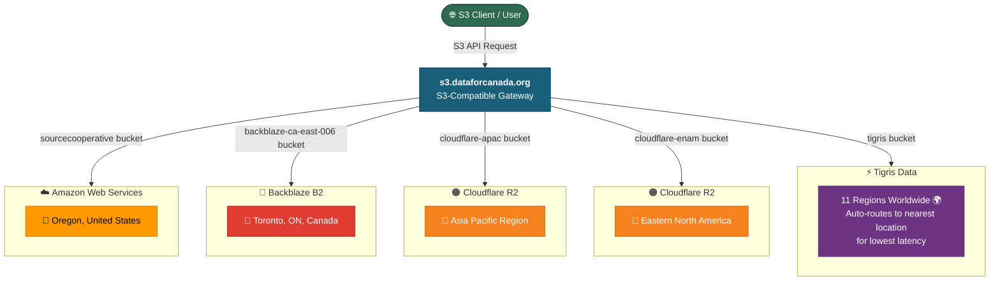

# Data for Canada / the Universe

## Background and Strategy
Presented By: Diego Ripley

Date: April 10, 2026


<style>
  .slidev-layout.cover {
    background-image: url('/datafortheuniverse-background.webp') !important;
    background-size: cover !important;
    background-position: center !important;
  }
  h1, h2, p { text-shadow: 1px 1px 4px rgba(0,0,0,0.9); }
</style>

---
layout: cover
hideInToc: true
---

"Space is big. You just won't believe how vastly, hugely, mind-bogglingly big it is. I mean, you may think it's a long way down the road to the chemist's, but that's just peanuts to space."

Douglas Adams, Hitchicker's Guide to the Galaxy, #1

<style>
  .slidev-layout.cover {
    background-image: url('/dont-panic-background-01.webp') !important;
    background-size: cover !important;
    background-position: center !important;
  }
  p { text-shadow: 1px 1px 4px rgba(0,0,0,0.9); }
</style>

---
hideInToc: true
level: 4
---



---
---

```xml
<?xml version="1.0" encoding="UTF-8"?>
<ListAllMyBucketsResult>
    <Owner>
        <ID>multistore-proxy</ID>
        <DisplayName>multistore-proxy</DisplayName>
    </Owner>
    <Buckets>
        <Bucket>
            <Name>backblaze-ca-east-006</Name>
        </Bucket>
        <Bucket>
            <Name>cloudflare-apac</Name>
        </Bucket>
        <Bucket>
            <Name>cloudflare-enam</Name>
        </Bucket>
        <Bucket>
            <Name>sourcecooperative</Name>
        </Bucket>
        <Bucket>
            <Name>tigris</Name>
        </Bucket>
    </Buckets>
</ListAllMyBucketsResult>

```

---
---

```bash
rclone --progress size d4c:backblaze-ca-east-006/
```

```
Total objects: 92.705k (92705)
Total size: 3.702 TiB (4070336275406 Byte)
Transferred:              0 B / 0 B, -, 0 B/s, ETA -
Checks:                 0 / 0, -, Listed 92705
Elapsed time:        29.7s
```

```bash
rclone --progress size d4c:cloudflare-apac/
```

```
Total objects: 13.183k (13183)
Total size: 99.782 GiB (107140636461 Byte)
Transferred:              0 B / 0 B, -, 0 B/s, ETA -
Checks:                 0 / 0, -, Listed 13183
Elapsed time:        13.9s
```

```bash
rclone --progress size d4c:cloudflare-enam/
```

```
Total objects: 932
Total size: 98.404 GiB (105660400478 Byte)
Transferred:              0 B / 0 B, -, 0 B/s, ETA -
Checks:                 0 / 0, -, Listed 932
Elapsed time:         0.3s
```

```bash
rclone --progress size d4c:tigris/
```

```
Total objects: 14.371k (14371)
Total size: 11.583 GiB (12437413070 Byte)
Transferred:              0 B / 0 B, -, 0 B/s, ETA -
Checks:                 0 / 0, -, Listed 14371
Elapsed time:         8.4s
```

But this one is 11.583 GiB * 11 locations.

---
---

<!--
Ran this on AWS CloudShell
-->

```
aws s3 ls s3://us-west-2.opendata.source.coop/dataforcanada/ --summarize --recursive --human-readable
```

```
Total Objects: 165979
   Total Size: 14.8 TiB
```

---
layout: iframe-unscaled
hideInToc: true
level: 4
url: https://objex.labs.dataforcanada.org/
---

<!--
- Go through largest map tile package.
- sourcecooperative/dataforcanada/d4c-datapkg-orthoimagery/processed/ca-on_province_of_ontario-2024A000235_drape_eastern_ontario_orthoimagery_2024_16cm_v0.1.0-beta.pmtiles
-->

---
---
# IPFS & AT Protocol
- [Matadisco](https://matadisco.org/)
- [Matadisco Geo Viewer](https://ipfs-fdn.github.io/matadisco-geo-viewer/)
- [Matadisco Viewer](https://vmx.github.io/matadisco-viewer/), [Git](https://github.com/vmx/matadisco-viewer/)

<!--
- For Geo Viewer, click on Live Stream
-->

---
---
# BitTorrent
- Cheap infrastructure
- High bandwidth
- [Academic Torrents](https://academictorrents.com/)
  - [Sample 215.75GB torrent](https://academictorrents.com/details/adb5741cdcb9352848cc80c976629b44720a04c2)

---
---
# Example
University student is writing a presentation on X topic. They can share their specification that links to the appropriate data sources.

---
---
<!--
This is just a way to disseminate your results to the masses.
-->
# Folia
- [Specification](https://spec.folia.sh/)
